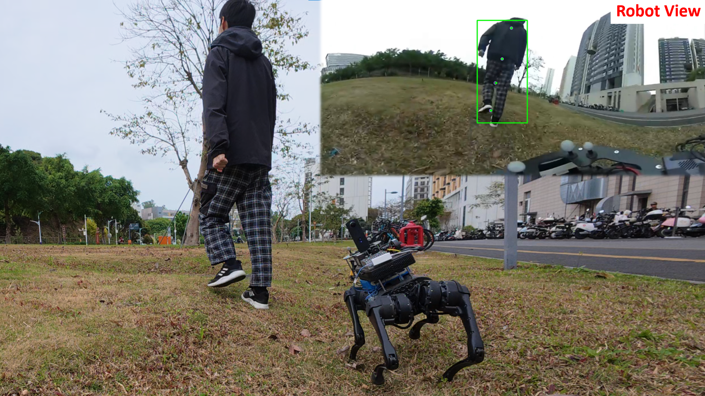

# MPL-Ego
Code and Dataset for "Monocular Person Localization under Camera Ego-motion".
> <b>Monocular Person Localization under Camera Ego-motion</b>  
> Yu Zhan, Hanjing Ye, Hong Zhang  
> Under Review 
> [<u>site</u>](https://medlartea.github.io/rpf-quadruped/), [<u>video</u>](https://youtu.be/Q5UpFzV2vVI)

## TODO

- [ ] Release code and dataset.
